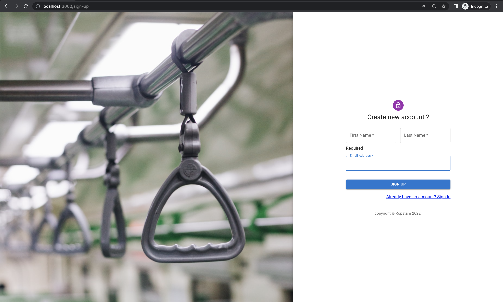
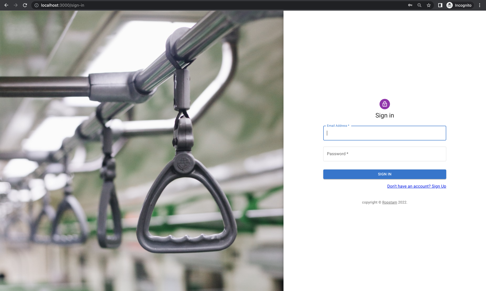
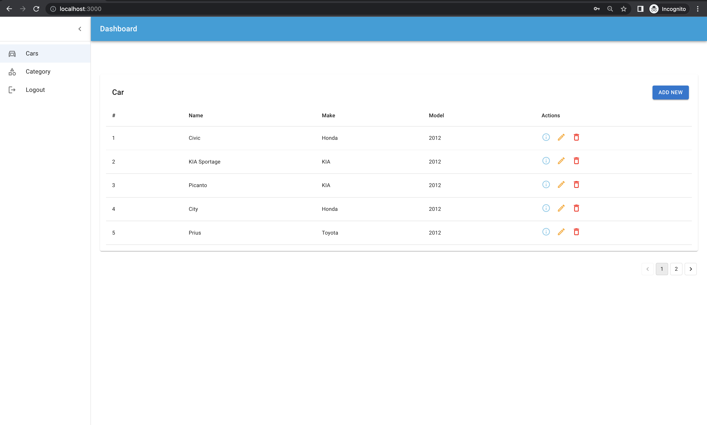
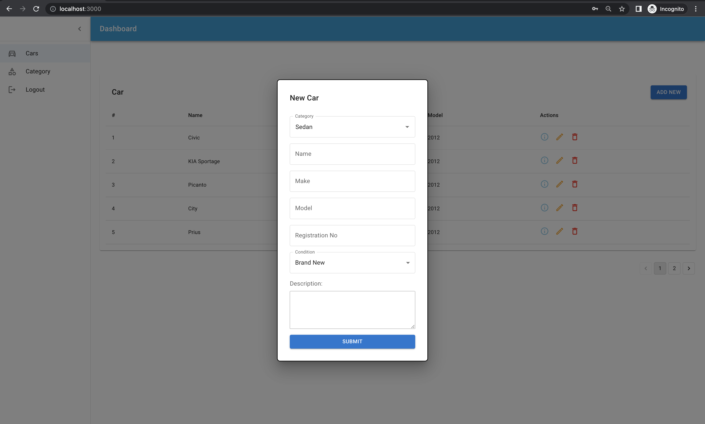
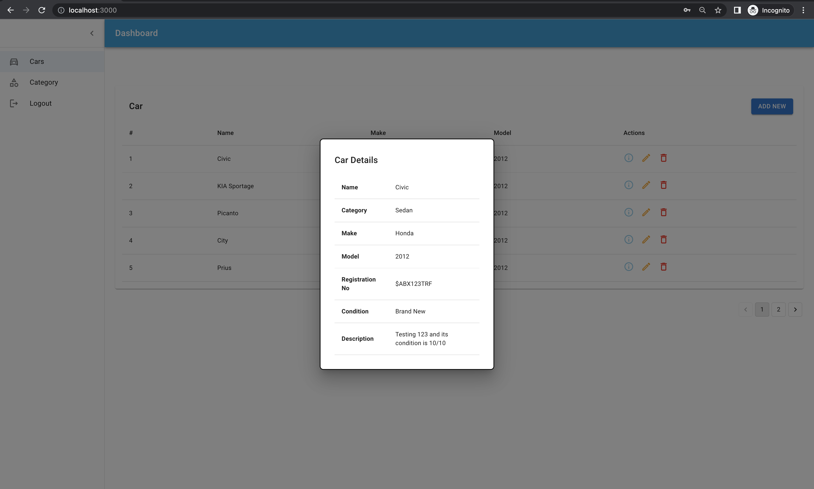
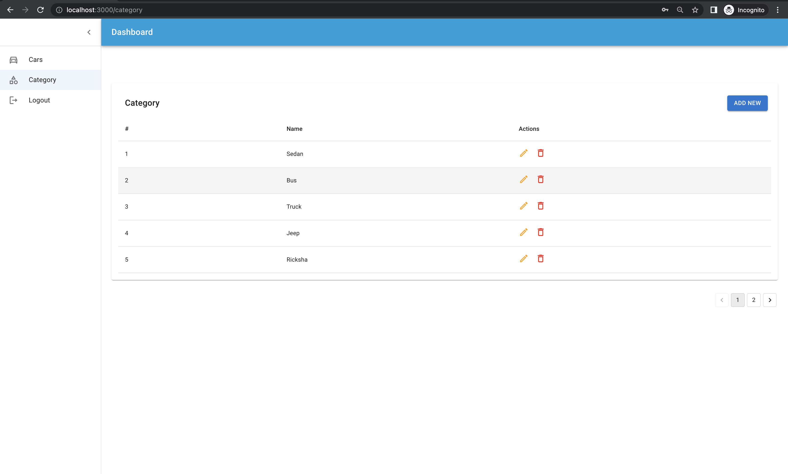
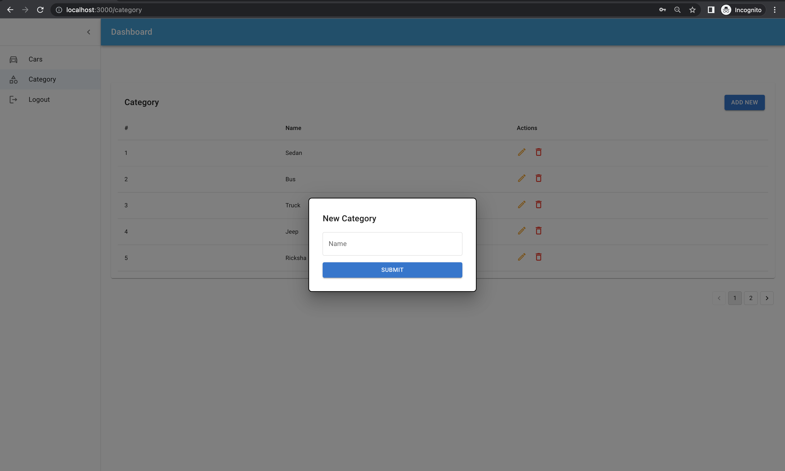

# Ropstam Frontend Task


This task has the following feature such as login, signup, CRUD operation of category and car.

### Why I am not using Redux or Context API ?

This is small application which have only 4-5 features. To avoid code complexity I haven't used it. 
Basically this state Management Tools are used for handling large data and for complex feature. Otherwise, 
I have no any issue to implement code according to Redux or Context API. 

### Special thanks go for the owners of these plugins:
- [Material UI](https://mui.com/)
- [Axios](https://axios-http.com/docs/intro)
- [Formik](https://formik.org/)
- [React Router dom](https://reactrouter.com/)


We are very excited to share this dashboard with you and we look forward to hearing your feedback!

## Table of Contents

* [ScreenShots](#screenshots)
* [Quick Setup](#quick-setup)
* [File Structure](#file-structure)
* [Browser Support](#browser-support)
* [Licensing](#licensing)


## Screenshots









## File Structure

Within the download you'll find the following directories and files:

```
frontend
.
│
├── .gitignore
├── README.md
├── package.json
├── public
│   └── index.html
└── src
    ├── index.js
    ├── App.js
    ├── pages
    │   ├── cars
    │   │   └── cars.js
    │   ├── category
    │   │   └── category.js
    │   ├── signin
    │   │   └── signin.js
    │   └── signup
    │       └── signup.js
    ├── components
    │   ├── copyright
    │   │   └── copyright.js
    │   ├── forms
    │   │   ├── addCar.js
    │   │   └── addCategory.js
    │   ├── layout
    │   │   ├── dashboardLayout.js
    │   │   ├── dashboardLayout.styled.js
    │   │   └── randomImageLayout.js
    │   ├── modals
    │   │   ├── carDetails.js
    │   │   └── deleteItem.js
    │   └── muiSortableTable
    │       └── muiSortableTable.js
    └── utils
        ├── constanst.js
        └── helper.js
```

## Quick Setup
Install the dependencies and devDependencies.

```sh
cd {INSTALLED_REPO}
yarn install
```

Run Project

```sh
yarn start
```

## Browser Support

At present, we officially aim to support the last two versions of the following browsers:

    

## Licensing

- Copyright 2022 AhmadyarMeo (https://github.com/AhmadyarRashid)
